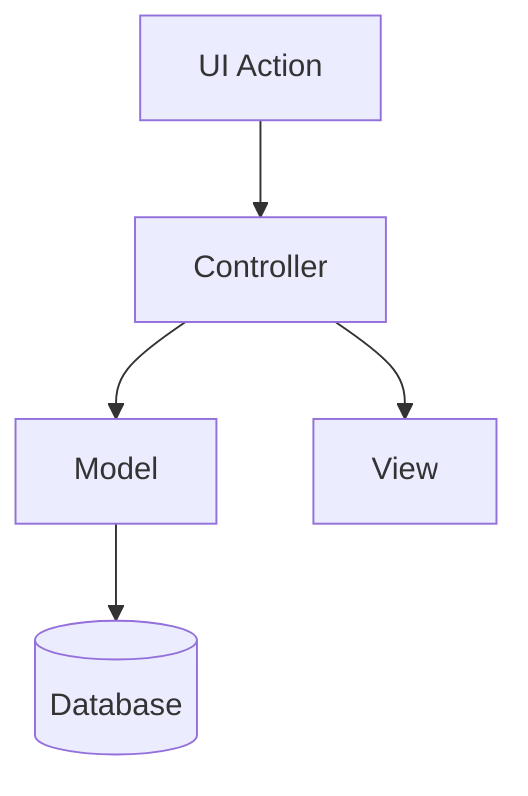

# Judul Fitur

Ringkasan singkat tentang tujuan fitur dan nilai bisnisnya.

## Metadata
- Audience: Admin / Apoteker / Semua Pengguna
- Status: Draft / Final
- Penanggung Jawab: 
- Tanggal: 

## Permissions
- Role yang dapat mengakses: (admin-only / apoteker / keduanya)
- Guard di controller: sebutkan method dan pengecekan role
- Visibilitas menu (sidebar/header)

## Navigasi & Routes
- Navigasi UI: Sidebar > … > …
- Routes:
  - GET `/path` → Controller@method
  - POST `/path` → Controller@method

## Penggunaan (User Guide)
1. Langkah 1 …
2. Langkah 2 …
3. Output/hasil yang diharapkan …

## Tampilan (UI)
- Screenshot/Mockup (opsional)
- Komponen utama yang muncul (form, tabel, grafik)

## Alur Data (Data Flow)


## Skema Data (Schema)
- Tabel terkait: `table_a`, `table_b`
- Kolom penting: 
  - `table_a.id` (PK), `table_a.name`, …
- Relasi singkat: `table_a` 1..* `table_b`
- Catatan migrasi (jika ada): …

## Referensi Kode
- Controllers:
  - `application/controllers/Module.php#method`
- Models:
  - `application/models/Model_name.php#method`
- Views:
  - `application/views/module/view.php`
- Routes:
  - `application/config/routes.php`
- Helpers/Libraries (jika ada): …

## API (jika relevan)
- Endpoint: `GET /api/v1/...`
- Request params: …
- Response (contoh):
```json
{
  "status": "success",
  "data": {}
}
```

## CSV (jika relevan)
- Kolom: `col_a, col_b, col_c`
- Contoh baris: `a,b,c`

## Validasi & Error Handling
- Aturan validasi form/input
- Flash message & kode HTTP
- Penanganan edge cases

## Keamanan & Privasi
- Guard role, sanitasi input, CSRF (bila ada)
- Data sensitif & masking (bila ada)

## Kinerja
- Query berat, pagination, caching (bila ada)

## Pengujian
- Checklist manual
- (Opsional) Kasus uji otomatis/unit

## Changelog
- v1: …
- vNext: …

## Referensi
- Dokumen terkait: …
- Isu/PR terkait: …
