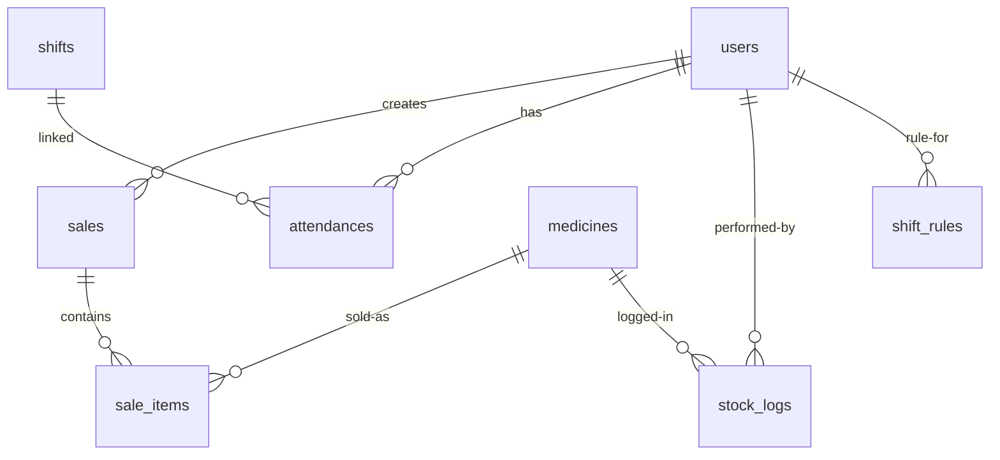

# Ringkasan Skema Data

Dokumen ini merangkum entitas utama, relasi, serta catatan implementasi. Skema dapat bervariasi antar environment; sesuaikan dengan SQL yang Anda miliki.

## Entitas Utama

### users
- id (PK)
- username (unique)
- name
- password_hash
- role (admin|apoteker)
- active (tinyint, 1=aktif) — beberapa DB mungkin memakai nama kolom berbeda
- created_at, updated_at

### medicines
- id (PK)
- code (unique, optional)
- name
- category_id (FK → medicine_categories.id, optional)
- unit (tablet/pcs/dll)
- price (int)
- current_stock (int) — dapat dihitung dari log stok jika tidak ada kolom ini
- created_at, updated_at

### medicine_categories (opsional)
- id (PK)
- name

### sales
- id (PK)
- date (datetime)
- customer_name (optional)
- subtotal, discount, total (int)
- user_id (FK → users.id) — kasir
- created_at, updated_at

### sale_items
- id (PK)
- sale_id (FK → sales.id)
- medicine_id (FK → medicines.id)
- qty (int)
- price (int)
- total (int)

### stock_logs
- id (PK)
- medicine_id (FK → medicines.id)
- type (in|out|opname)
- qty (int)
- note (optional)
- created_at (datetime)
- user_id (FK → users.id, optional)

### attendances
- id (PK)
- user_id (FK → users.id)
- date (date)
- shift_id (FK → shifts.id, nullable)
- checkin_time (datetime, nullable)
- checkout_time (datetime, nullable)
- status (present|absent|late|leave, optional)
- notes (optional)

### shifts
- id (PK)
- date (date)
- shift_name (varchar)
- start_time (time)
- end_time (time)

### shift_rules
- id (PK)
- user_id (FK → users.id)
- shift_name (varchar)
- days_of_week (varchar, comma-separated 1..7)
- effective_start (date, nullable)
- effective_end (date, nullable)
- active (tinyint 1/0)
- created_at, updated_at

### api_keys
- id (PK)
- name
- key (unique)
- active (tinyint 1/0)
- created_at, revoked_at (nullable)

## Relasi (ERD)

## Catatan Implementasi
- Kolom `active` pada `users` dapat berbeda nama di beberapa DB; controller sudah memakai filter kondisional.
- Nilai stok berjalan dapat dihitung dari `stock_logs` jika tidak ada kolom `current_stock`.
- Harap validasi foreign key sesuai data aktual.

## Referensi Kode
- Models: `User_model.php`, `Medicine_model.php`, `Sale_model.php`, `Sale_item_model.php`, `Stock_model.php`, `Attendance_model.php`
- Controllers: `Sales.php`, `Stock.php`, `Attendance.php`, `Shifts.php`, `Reports.php`, `Settings.php`
- SQL contoh: lihat dump DB internal Anda.
